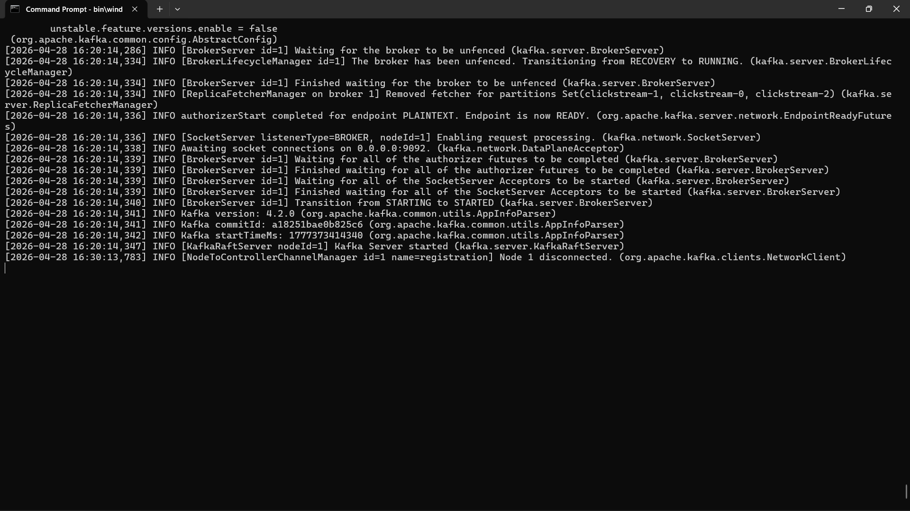
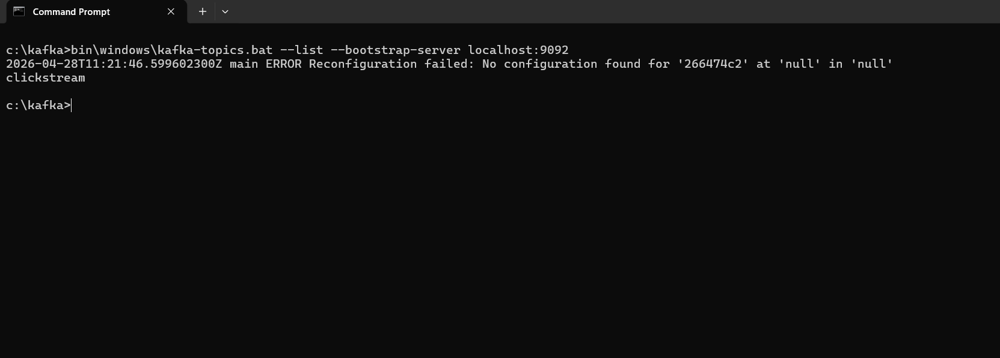
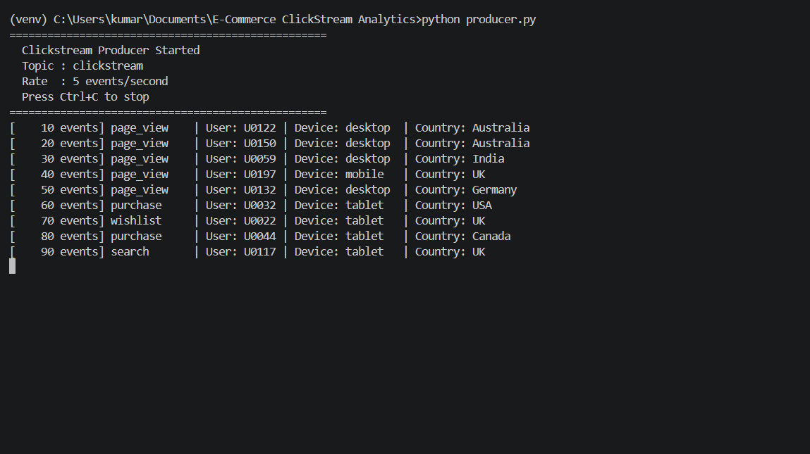
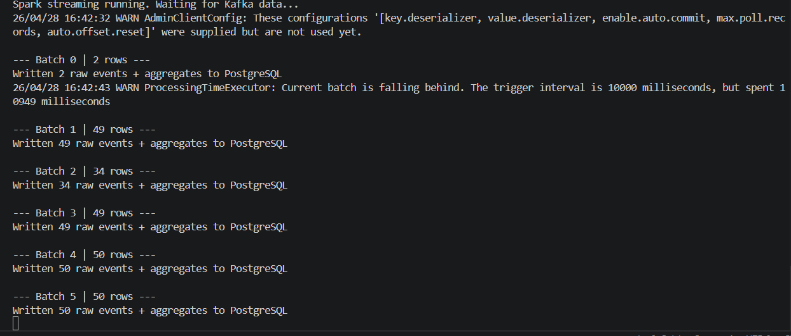
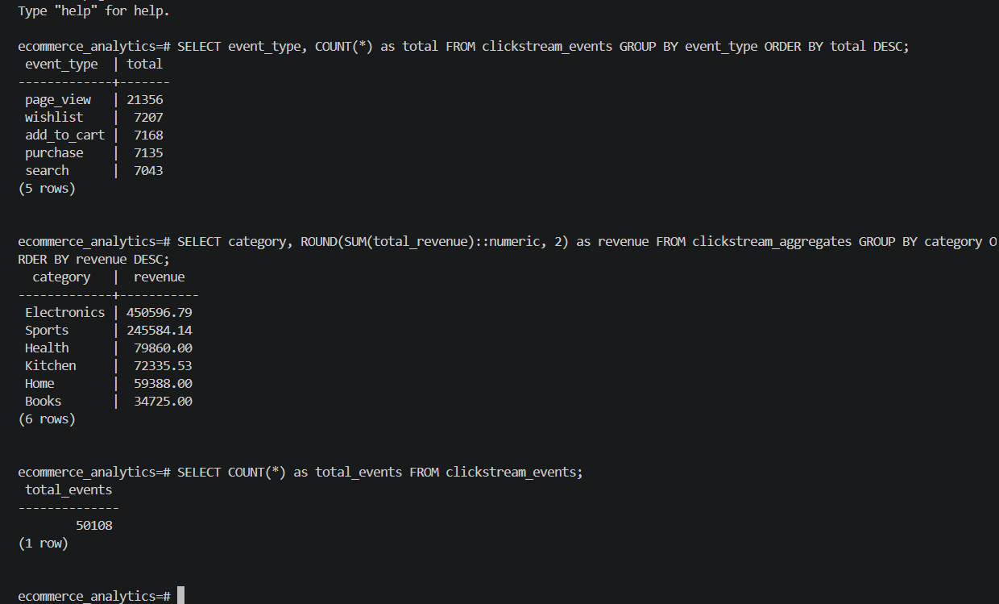
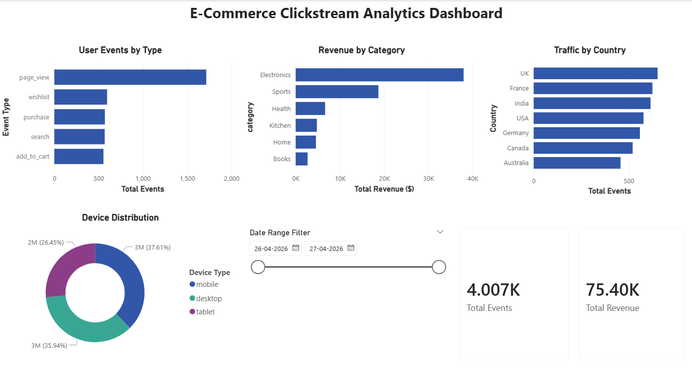

# E-Commerce Clickstream Analytics Pipeline

A real-time clickstream analytics pipeline built using **Apache Kafka**, **Apache Spark Streaming**, **PostgreSQL**, and **Power BI**, designed to ingest high-volume user behaviour events and enable live business intelligence dashboards.

---

## Problem Statement

E-commerce platforms generate massive volumes of user events (page views, add-to-cart, purchases, searches, etc.).

Traditional batch ETL pipelines struggle with:
- Real-time ingestion at scale
- Live dashboard updates
- High-volume event processing
- Multi-device and multi-country traffic analysis

This project demonstrates how to design and build a **production-style real-time clickstream analytics pipeline** that solves these problems.

---

## High-Level Architecture

```
[Python Producer] → [Apache Kafka] → [Spark Streaming] → [PostgreSQL] → [Power BI]
```

### Core Principles
- **Decoupled producers and consumers**
- **Real-time stream processing**
- **Secure credential management via environment variables**
- **Scalable micro-batch processing**
- **Live BI dashboard with auto-refresh**

---

## Platform Components

### 1. Clickstream Producer (`producer.py`)
- Simulates 200 concurrent users browsing an e-commerce store
- Generates realistic events: page_view, add_to_cart, purchase, search, wishlist
- Sends 5 events/second to Kafka topic
- Covers 10 product categories across 7 countries

### 2. Apache Kafka (Event Backbone)
- Acts as the durable, ordered event log
- Runs in KRaft mode (No Zookeeper required)
- Topic: `clickstream` with 3 partitions
- Enables decoupled producers and consumers

### 3. Apache Spark Streaming (`spark_consumer.py`)
- Reads events from Kafka in micro-batches (every 10 seconds)
- Parses and validates JSON event schema
- Writes raw events to PostgreSQL
- Computes aggregates by event type and category
- Writes aggregated metrics to PostgreSQL

### 4. PostgreSQL (Analytics Database)
- Stores raw clickstream events
- Stores pre-aggregated metrics
- Provides SQL interface for Power BI

### 5. Power BI Dashboard
- Connects directly to PostgreSQL
- Shows real-time analytics:
  - User events by type
  - Revenue by product category
  - Traffic by country
  - Device distribution
  - Total events and revenue KPIs

---

## Tech Stack

| Component | Technology | Version |
|-----------|-----------|---------|
| Event Producer | Python | 3.12 |
| Message Broker | Apache Kafka (KRaft) | 4.x |
| Stream Processor | Apache Spark Streaming | 3.5.8 |
| Database | PostgreSQL | 17 |
| Visualization | Power BI Desktop | Latest |
| OS | Windows 11 | - |

---

## Project Structure

```
ecommerce-clickstream-analytics/
│
├── producer.py          ← Kafka event producer
├── spark_consumer.py    ← Spark streaming consumer
├── requirements.txt     ← Python dependencies
├── README.md            ← Project documentation
├── RUNBOOK.md           ← Operations guide
└── .gitignore
```

---

## Dashboard Preview

### Key Metrics
- **User Events by Type** — page_view, add_to_cart, purchase, search, wishlist
- **Revenue by Category** — Electronics, Sports, Health, Kitchen, Home, Books
- **Traffic by Country** — UK, France, India, USA, Germany, Canada, Australia
- **Device Distribution** — Mobile, Desktop, Tablet
- **Total Events KPI** — Live count of processed events
- **Total Revenue KPI** — Live sum of purchase revenue

---

## Screenshots

### Kafka Server Running


### Kafka Topic Created


### Producer Sending Events


### Spark Processing Batches


### PostgreSQL Data


### Power BI Dashboard


---

## How to Run

### Prerequisites
- Java 17
- Python 3.12
- Apache Kafka 4.x
- Apache Spark 3.5.8
- PostgreSQL 17
- Power BI Desktop

### Step 1 — Start Kafka
```cmd
cd C:\kafka
bin\windows\kafka-server-start.bat config\server.properties
```

### Step 2 — Set Environment Variables
```cmd
set PG_PASSWORD=your_postgres_password
```

### Step 3 — Install Dependencies
```cmd
pip install -r requirements.txt
```

### Step 4 — Run Producer
```cmd
python producer.py
```

### Step 5 — Run Spark Consumer
```cmd
spark-submit --packages org.apache.spark:spark-sql-kafka-0-10_2.12:3.5.3,org.postgresql:postgresql:42.7.3 spark_consumer.py
```

### Step 6 — Connect Power BI
- Server: `localhost`
- Database: `ecommerce_analytics`
- Username: `analytics_viewer`
- Password: `viewer_pass_123`

---

## Database Schema

### clickstream_events
| Column | Type | Description |
|--------|------|-------------|
| event_id | SERIAL | Primary key |
| user_id | VARCHAR | Simulated user |
| session_id | VARCHAR | Browser session |
| event_type | VARCHAR | Type of event |
| product_id | VARCHAR | Product identifier |
| product_name | VARCHAR | Product name |
| category | VARCHAR | Product category |
| price | DECIMAL | Product price |
| device_type | VARCHAR | mobile/desktop/tablet |
| country | VARCHAR | User country |
| timestamp | TIMESTAMP | Event time |

### clickstream_aggregates
| Column | Type | Description |
|--------|------|-------------|
| event_type | VARCHAR | Type of event |
| category | VARCHAR | Product category |
| total_events | INTEGER | Event count |
| unique_users | INTEGER | Distinct users |
| total_revenue | DECIMAL | Purchase revenue |
| avg_price | DECIMAL | Average price |

---

## Security

- PostgreSQL password stored as environment variable `PG_PASSWORD`
- Never hardcoded in source files
- `.gitignore` excludes sensitive files

---

## Future Improvements

- Deploy to AWS (MSK + EMR + RDS)
- Add fraud detection alerts
- Add funnel analysis (page_view → purchase conversion)
- Add A/B testing support
- Add Tableau integration
- Real-time email alerts on revenue drops
